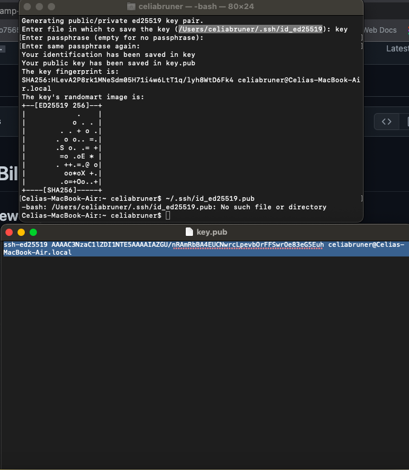
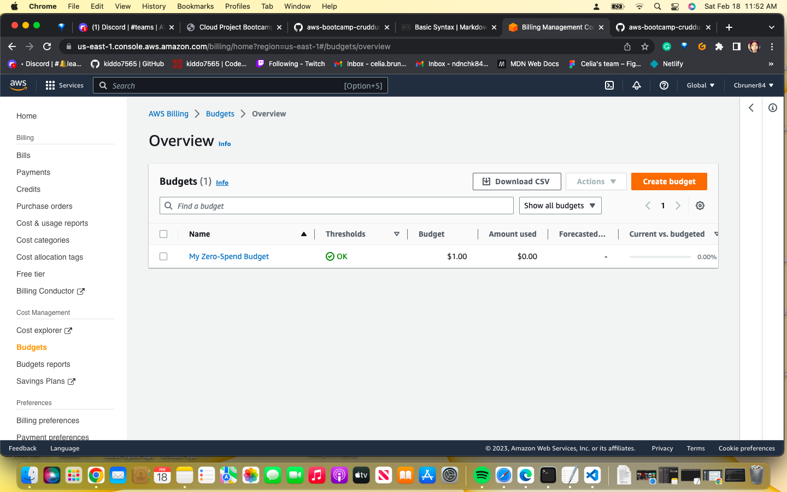
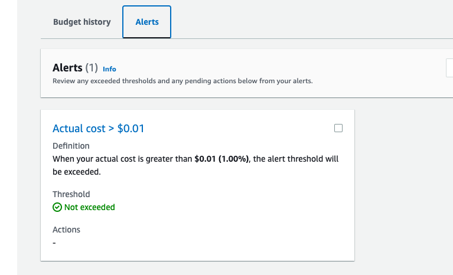

# Week 0 — Billing and Architecture

## Required Homework/Tasks

[Crudder Logical Diagram] (https://lucid.app/lucidchart/1176d5ca-2de9-4b70-b6d3-c9c934f22359/edit?viewport_loc=-1000%2C-428%2C4712%2C2240%2C0_0&invitationId=inv_810a097f-9079-46d6-8384-bbd27254227e)

[Cruddur Conceptual Diagram] (https://lucid.app/lucidchart/1176d5ca-2de9-4b70-b6d3-c9c934f22359/edit?viewport_loc=-1000%2C-428%2C4712%2C2240%2C0_0&invitationId=inv_810a097f-9079-46d6-8384-bbd27254227e)

## CLI

I had an extremely hard time setting up the CLI, even while following the videos. I had to set up the CLI locally on my Mac and had a difficult time finding the folder. I eventually got it set up.

## AWS Budget

##Homework Challenges
